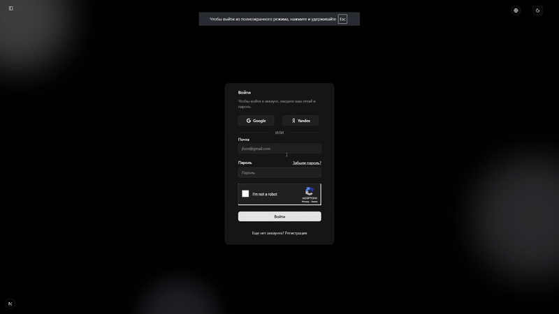
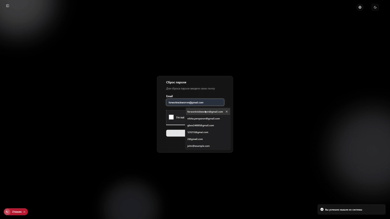
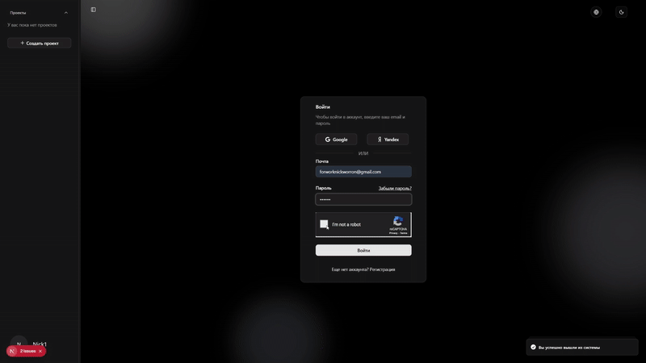
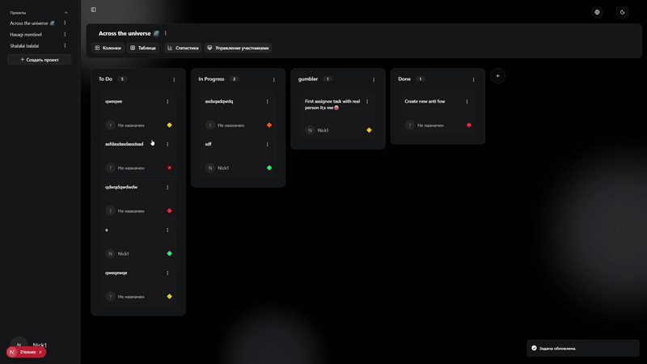
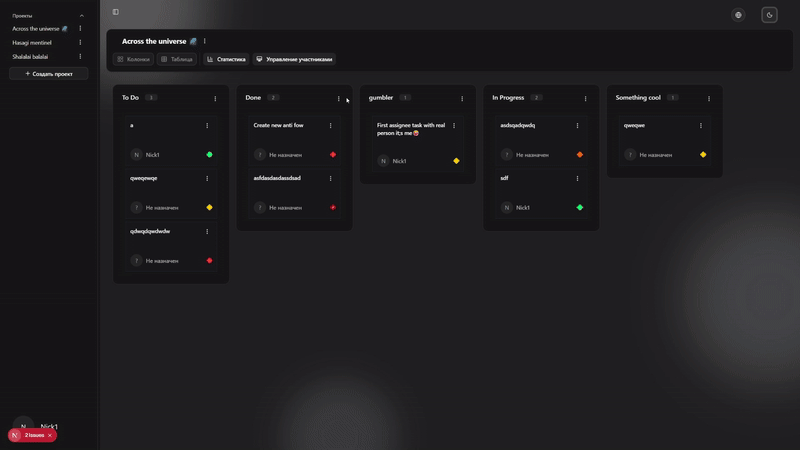
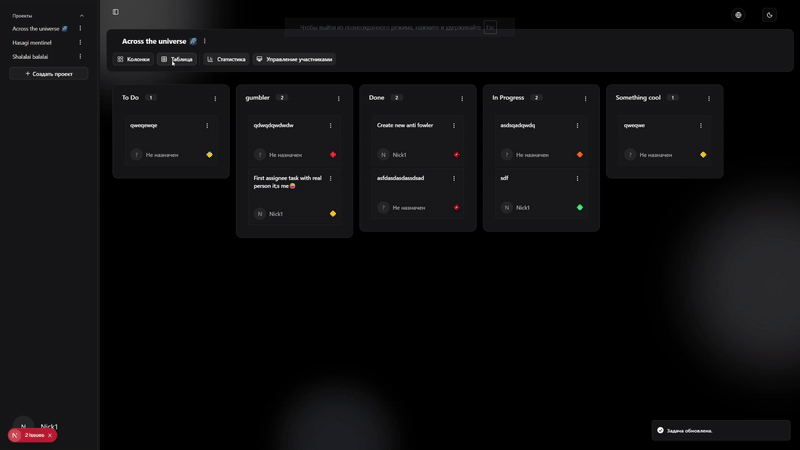
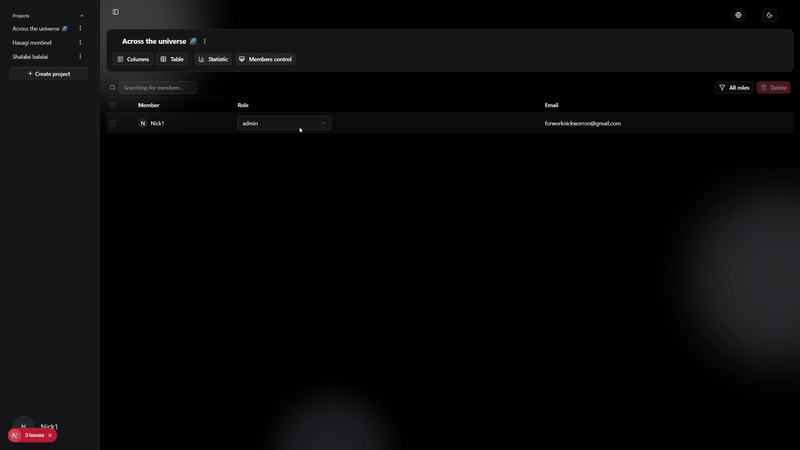

# KANBAN-ULTRA Backend

**Русский:** Мощный бэкенд для современного Kanban-проекта с продвинутыми механизмами авторизации и аналитики.  
**English:** Powerful backend for a modern Kanban project with advanced authentication and analytics features.

---

## 🎬 Демонстрация проекта / Project Demo

Ниже представлены основные функции проекта в действии.

 GIF                                            | Описание / Description                                                                                                                            |
------------------------------------------------|---------------------------------------------------------------------------------------------------------------------------------------------------|
     | Русский: OAuth вторизация.   English: OAuth authorization.                                                                                     |
|       | Русский: Стандартный вход, сброс пароля с кодом по почте.   English: Standard login, password reset with code by mail.                         |
|  | Русский: Вход с кодом двухфакторной аутентификаций.   English: Login with two-factor authentication code.                                      |
       | Русский: Презентация канбан доски, ДрагНДроп и созданение колонок.   English: Presentation of Kanban board, DragNdrop and creation of columns. |
   | Русский: Презентация канбан доски, ДрагНДроп и созданение колонок.   Presentation of Kanban board, DragNdrop and creation of columns.          |
   | Русский: Табличный вид канбан доски, статистика и аналитика.   English: Table view of kanban board, statistics and analytics.                  |
   | Русский: Админ панель управления участниками.   English: Administrator control panel for participants.                                         |

---

## 🔹 Полное описание / Full Description

**Русский:**  
Backend проекта KANBAN-ULTRA обеспечивает все необходимые сервисы для работы Kanban-доски: управление проектами, колонками и задачами, авторизация пользователей, аналитика и статистика. Используется двухфакторная аутентификация, поддержка OAuth через Google и Яндекс, а также стандартная авторизация через email и пароль. Почтовые уведомления обеспечивают приглашение участников, подтверждение аккаунта и смену пароля. Реализовано кеширование через Redis, контроль доступа по ролям и безопасная работа с сессиями.

**English:**  
The backend of KANBAN-ULTRA provides all necessary services for a Kanban board: project, column, and task management, user authentication, analytics, and statistics. Two-factor authentication is implemented along with OAuth login (Google, Yandex) and standard email/password login. Email notifications handle user invitations, account confirmation, and password changes. Redis caching, role-based access control, and secure session management are fully supported.

---

## ⚡ Фичи / Features

**Русский:**
- Авторизация пользователей: стандартная, через OAuth, двухфакторная, сброс пароля.
- Почтовые уведомления: приглашение участников, подтверждение аккаунта, коды и токены для смены пароля.
- Контроль доступа по ролям: роли в проекте, роли пользователей.
- CRUD для проектов, колонок и задач.
- Drag & Drop поддержка на фронтенде (через API).
- Полная аналитика и статистика проекта.
- Кеширование с Redis для ускорения работы.
- Защита через каптчу при регистрации/логине.
- Документирование API с Swagger и JSDoc.

**English:**
- User authentication: standard, OAuth, two-factor, password reset.
- Email notifications: user invitations, account confirmation, password tokens/codes.
- Role-based access control: project roles, application roles.
- CRUD operations for projects, columns, and tasks.
- Drag & Drop support for frontend through API.
- Full analytics and project statistics.
- Redis caching for faster performance.
- Captcha protection during registration/login.
- API documentation via Swagger and JSDoc.

---

## 🛠 Используемые технологии / Technologies & Tools

**Русский:**
- **Ядро:** NestJS
- **База данных:** PostgreSQL (через TypeORM)
- **Кеширование:** Redis + ioredis
- **Авторизация и сессии:** express-session, connect-redis, argon2
- **Почта и уведомления:** nodemailer, @nestjs-modules/mailer, Resend, Twilio
- **Документация:** Swagger, JSDoc
- **Безопасность:** Helmet, каптча через @nestlab/google-recaptcha
- **Логирование:** pino, pino-pretty, nestjs-pino
- **Дополнительно:** RxJS, class-validator, class-transformer, compression

**English:**
- **Core:** NestJS
- **Database:** PostgreSQL via TypeORM
- **Caching:** Redis + ioredis
- **Authentication & Sessions:** express-session, connect-redis, argon2
- **Email & Notifications:** nodemailer, @nestjs-modules/mailer, Resend, Twilio
- **Documentation:** Swagger, JSDoc
- **Security:** Helmet, captcha via @nestlab/google-recaptcha
- **Logging:** pino, pino-pretty, nestjs-pino
- **Additional:** RxJS, class-validator, class-transformer, compression